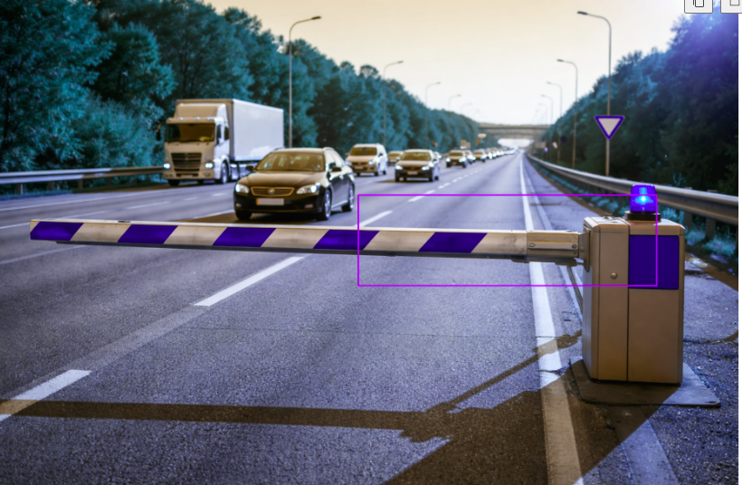

# AV-Barrier Auto-Labeler 🚧 🤖

[](YOUR_COLAB_LINK_HERE)
[](https://opensource.org/licenses/MIT)

## 📌 Project Overview
Manual labeling of complex road infrastructure like **Jersey Barriers** and **Guardrails** is a major bottleneck in Autonomous Vehicle (AV) development. This project implements an AI-assisted pipeline that combines **GroundingDINO** and **SAM (Segment Anything Model)** to automate the annotation process.

**Results:** Achieved ~80% label accuracy (mIoU) on road barrier subsets, reducing manual annotation time by over 80%.

---

## ⚙️ How It Works
The pipeline uses a "Detect-then-Segment" approach:
1. **Natural Language Prompting:** User inputs a string (e.g., `"concrete barrier, traffic cone"`).
2. **Zero-Shot Detection:** GroundingDINO identifies bounding boxes based on the text.
3. **High-Precision Segmentation:** SAM uses those boxes as prompts to generate pixel-perfect masks.
4. **Dataset Export:** Automatically generates labels in **YOLO (TXT)** and **COCO (JSON)** formats.

---

## 🚀 Quick Start (No Local GPU Required)
The easiest way to test this project is via Google Colab:
1. Open the [Demo Notebook](https://colab.research.google.com/drive/1IKdTSiD29b50T9lXmREl-uoBAT7NuSnZ?usp=sharing).
2. Upload your dashcam images.
3. Run all cells to see the auto-generated masks.


### Local Installation (Requires GPU)
```bash
git clone https://github.com/Malaika01/AV-Barrier-Auto-Labeler-.git
pip install -r requirements.txt
python app.py --image data/sample_road.jpg --prompt "jersey barrier"


## 📸 Demo Output


*GroundingDINO detects the barrier (bounding box) → 
SAM generates the segmentation mask (purple overlay)*